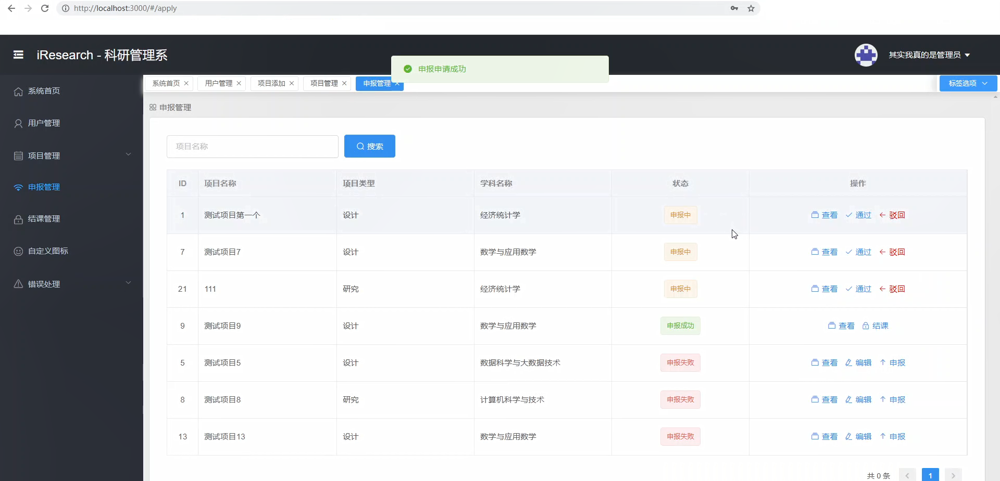

# iResearch

## 1. 基本功能
### 1.1 介绍

基于Springboot、Vue，前后端分离的科研管理系统，实现了简单的科研项目的添加申报结课管理 （业务逻辑比较简单，主要是整合练手）

技术栈：Springboot，MybatisPlus，Swagger ，Shiro，Vue，ElementPlus，Mysql，(Redis)

前端后台管理系统： [vue-manage-system](https://github.com/lin-xin/vue-manage-system)

### 1.2 文件树
~~~
iResearch
| 后端
├─src
│  ├─main
│  │  ├─java
│  │  │  └─com
│  │  │      └─iresearch
│  │  │          ├─config
│  │  │          ├─constant
│  │  │          ├─controller
│  │  │          ├─entity
│  │  │          ├─generator
│  │  │          ├─mapper
│  │  │          ├─service
│  │  │          │  └─impl
│  │  │          ├─shiro
│  │  │          │  └─realm
│  │  │          ├─util
│  │  │          └─vo
│  │  └─resources
│  │      ├─com
│  │      │  └─iresearch
│  │      │      └─mapper
│  │      ├─META-INF
│  │      ├─static
│  │      └─templates
│  └─test
│      └─java
│          └─com
│              └─iresearch
| 前端
└─web
    ├─public
    └─src
        ├─api
        ├─assets
        │  ├─css
        │  └─img
        ├─components
        ├─plugins
        ├─router
        ├─store
        ├─utils
        └─views
~~~

### 1.3 功能

#### 1.3.1 相关图

- 流程图

- 类图

- ER图

#### 1.2.2 程序截图

- 登录

- 首页

- 用户管理

- 项目管理

- 项目查看

- 申报管理

- 结课管理

## 2. 运行

### 2.0 数据与工具

- 数据库：  [iresearch.sql](/static/iresearch.sql)

- 工具：（推荐） IDEA、VSCode，Navicat

- 代码
~~~shell
git clone https://github.com/lengqie/iResearch.git
~~~

### 2.1 后端

IDEA 打开导入依赖后直接运行

(Swaggwer：[http://127.0.0.1:8081/swagger-ui/](http://127.0.0.1:8080/swagger-ui/))

### 2.2 前端

~~~shell
cd web
npm install
npm run dev
~~~

## 3. 其他

### 3.1 开发日志

[DEVLOG.md](DEVLOG.md)

### 3.2 问题

- [ ] 数据库 由于测试数据量太小未设置索引

- [ ] 后端 shiro-redis 许久未更新 或许 有更好的整合方案（默认关闭了）

- [ ] 后端 存在中文时不采用 restful（解决方案 https://devd.cn/d/40-springboot-shiro-restful-url）

- [ ] 后端 Controller 权限过滤存在冗余

- [ ] 后端 登录过于简单 没有进行字符限制 与 加盐

- [ ] 前端 代码大量复用 冗余过大

- [ ] 前端 单页重复请求 API 徒增后端负担 （后端Controller有关）

- [ ] 前端 Vue 中 setup 与 methods 混用 (setup 更新数据时无法双向绑定 未知...只能使用 methods)

- [ ] ...
  
 
## 4. 协议
Licensed under the *MIT* license